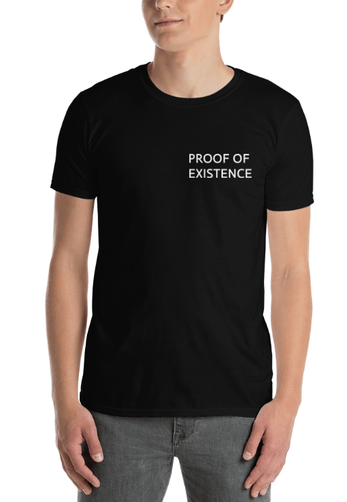

# Opera-Merch-Design

Cryptocurrencies are run by several computers coming to agreement through a consensus algorithm. This consensus algorithm is what allows these digital currencies to be decentralized. Consensus algorithms include:

- Proof of Work (Bitcoin and Ethereum)
- Proof of Stake (EOS and soon Ethereum)
- etc.

This design expands on this concept with the phrase "Proof of Existence," where existence is proven when you see a human in person.

Alternative phrases, such as "proof of fashion" and "proof of clothing" can be used. This design mimics the "Proof of" phrasing many consensus algorithms use.

